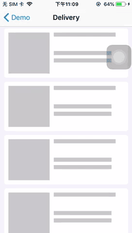
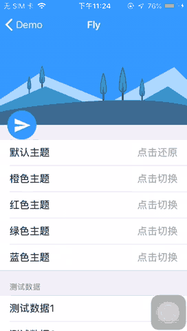
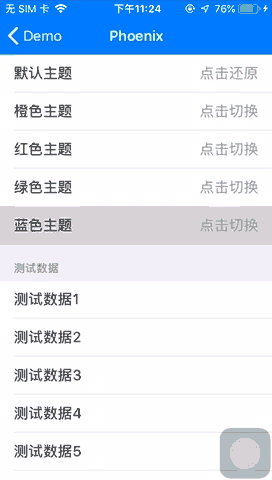
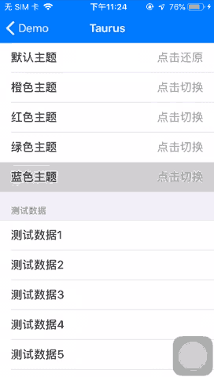
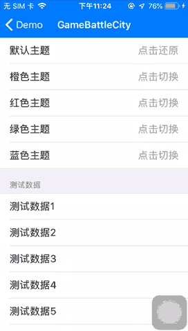
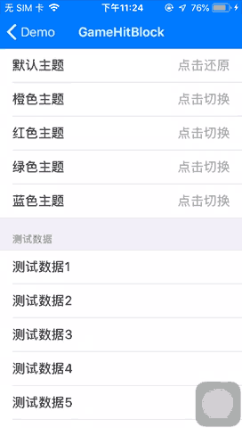
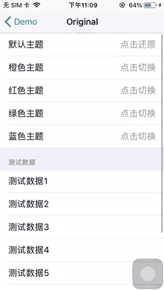
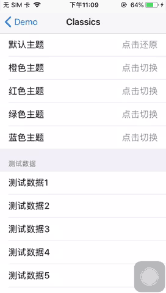

# IOS 智能下拉刷新框架 - SmartRefreshControl

[](https://www.apache.org/licenses/LICENSE-2.0)
[](https://www.cocoapods.org/)
[](https://developer.apple.com/)
[](https://github.com/scwang90)

## [English](art/gif/README_EN.md) | 中文

SmartRefreshControl 是 [SmartRefreshLayout](https://github.com/scwang90/SmartRefreshLayout) 的IOS版，和Android版在 `理念` 和 `外观` 上面保留相同的设计，但是由于 Android 和 IOS 两个系统的差别，IOS版本在功能使用和特性上与安卓版有所差别。刷新控件使用 ObjectiveC 语言编写，演示 DemoApp 使用 Swift 语言编写。 

目前 `SmartRefreshControl` 功能还不是很强大，也不太稳定，只是在界面层面实现了安卓版的功能。欢迎大家来体验与发现BUG，不推荐使用在正式项目中。


## 由来

大学毕业后我大部分时间从事安卓开发，在安卓版 `SmartRefresh` 大火之后，我开始转型 IOS 开发。到现在已经有三年的IOS开发经验，由于IOS上也还未有像  `SmartRefresh` 一样同一个开源库多种外观样式的刷新库，也想巩固自己所学的 IOS技能，我决定在闲暇之余把安卓 `SmartRefresh` 复刻到IOS平台来。经过一年多的努力总算初步完成了。

<!-- ## 特点功能:

 - 支持多点触摸
 - 支持淘宝二楼和二级刷新
 - 支持嵌套多层的视图结构 Layout (LinearLayout,FrameLayout...)
 - 支持所有的 View（AbsListView、RecyclerView、WebView....View）
 - 支持自定义并且已经集成了很多炫酷的 Header 和 Footer.
 - 支持和 ListView 的无缝同步滚动 和 CoordinatorLayout 的嵌套滚动 .
 - 支持自动刷新、自动上拉加载（自动检测列表惯性滚动到底部，而不用手动上拉）.
 - 支持自定义回弹动画的插值器，实现各种炫酷的动画效果.
 - 支持设置主题来适配任何场景的 App，不会出现炫酷但很尴尬的情况.
 - 支持设多种滑动方式：平移、拉伸、背后固定、顶层固定、全屏
 - 支持所有可滚动视图的越界回弹
 - 支持 Header 和 Footer 交换混用
 - 支持 AndroidX
 - 支持[横向刷新](https://github.com/scwang90/SmartRefreshHorizontal) -->

 <!-- - [属性文档](https://github.com/scwang90/SmartRefreshLayout/blob/master/art/md_property.md)
 - [常见问题](https://github.com/scwang90/SmartRefreshLayout/blob/master/art/md_faq.md)
 - [智能之处](https://github.com/scwang90/SmartRefreshLayout/blob/master/art/md_smart.md)
 - [更新日志](https://github.com/scwang90/SmartRefreshLayout/blob/master/art/md_update.md)
 - [博客文章](https://segmentfault.com/a/1190000010066071)
 - [源码下载](https://github.com/scwang90/SmartRefreshLayout/releases)
 - [多点触摸](https://github.com/scwang90/SmartRefreshLayout/blob/master/art/md_multitouch.md)
 - [自定义Header](https://github.com/scwang90/SmartRefreshLayout/blob/master/art/md_custom.md) -->

<!-- ## Demo
[下载 APK-Demo](https://github.com/scwang90/SmartRefreshLayout/raw/master/art/app-debug.apk)

 -->


#### 成品展示
|Delivery|Material|
|:---:|:---:|
|||
|[Refresh-your-delivery](https://dribbble.com/shots/2753803-Refresh-your-delivery)|[MaterialHeader](https://developer.android.com/reference/android/support/v4/widget/SwipeRefreshLayout.html)|

|BezierRadar|BezierCircle|
|:---:|:---:|
|||
|[Pull To Refresh](https://dribbble.com/shots/1936194-Pull-To-Refresh)|[Pull Down To Refresh](https://dribbble.com/shots/1797373-Pull-Down-To-Refresh)|

|FlyRefresh|DropBox|
|:---:|:---:|
|||
|[FlyRefresh](https://github.com/race604/FlyRefresh)|[DropBoxHeader](#1)|

|Phoenix|Taurus|
|:---:|:---:|
|||
|[Yalantis/Phoenix](https://github.com/Yalantis/Phoenix)|[Yalantis/Taurus](https://github.com/Yalantis/Taurus)

|BattleCity|HitBlock|
|:---:|:---:|
|||
|[FunGame/BattleCity](https://github.com/Hitomis/FunGameRefresh)|[FunGame/HitBlock](https://github.com/Hitomis/FunGameRefresh)


|StoreHouse|WaveSwipe|
|:---:|:---:|
|||
|[CRefreshLayout](https://github.com/cloay/CRefreshLayout)|[WaveSwipeRefreshLayout](https://github.com/recruit-lifestyle/WaveSwipeRefreshLayout)


|Original|Classics|
|:---:|:---:|
|||
|[FlyRefresh](https://github.com/race604/FlyRefresh)|[ClassicsHeader](#1)|


## 简单用例

#### 1.在 `Podfile` 中添加依赖


```

pod 'SmartRefreshControl', '~> 0.1.0'

```

#### 2.在 `UITableViewController` 中添加刷新头

```ObjectiveC

#import <SmartRefreshControl/SmartRefreshControl.h>

@interface UITableViewController ()

@property (strong, nonatomic) IBOutlet UITableView *tableView;  
@property (strong, nonatomic) UIRefreshBezierRadarHeader *header;  

@end

@implementation UITableViewController

- (void)viewDidLoad {
    [super viewDidLoad];
    
    //方式1: 初始化同时绑定事件
    [self setHeader:[UIRefreshBezierRadarHeader attach:self.tableView target:self action:@selector(onRefresh)]];

    //方式2: 先初始化，再绑定事件
    [self setHeader:[UIRefreshBezierRadarHeader attach:self.tableView]];
    [self.header addTarget:self action:@selector(onRefresh)];

    //方式2: 先创建，再绑定
    [self setHeader:[UIRefreshBezierRadarHeader new]];
    [self.header attach:self.tableView];
    [self.header addTarget:self action:@selector(onRefresh)];

}

@end

```

#### 3.添加刷新监听事件

```ObjectiveC

@implementation UITableViewController

- (void)onRefresh {
    [self.header finishRefresh]; //关闭刷新，可以改成请求网络，成功/失败之后再关闭刷新
}

@end

```

License
-------

    MIT License

    Copyright (c) 2021 树朾

    Permission is hereby granted, free of charge, to any person obtaining a copy
    of this software and associated documentation files (the "Software"), to deal
    in the Software without restriction, including without limitation the rights
    to use, copy, modify, merge, publish, distribute, sublicense, and/or sell
    copies of the Software, and to permit persons to whom the Software is
    furnished to do so, subject to the following conditions:

    The above copyright notice and this permission notice shall be included in all
    copies or substantial portions of the Software.

    THE SOFTWARE IS PROVIDED "AS IS", WITHOUT WARRANTY OF ANY KIND, EXPRESS OR
    IMPLIED, INCLUDING BUT NOT LIMITED TO THE WARRANTIES OF MERCHANTABILITY,
    FITNESS FOR A PARTICULAR PURPOSE AND NONINFRINGEMENT. IN NO EVENT SHALL THE
    AUTHORS OR COPYRIGHT HOLDERS BE LIABLE FOR ANY CLAIM, DAMAGES OR OTHER
    LIABILITY, WHETHER IN AN ACTION OF CONTRACT, TORT OR OTHERWISE, ARISING FROM,
    OUT OF OR IN CONNECTION WITH THE SOFTWARE OR THE USE OR OTHER DEALINGS IN THE
    SOFTWARE.